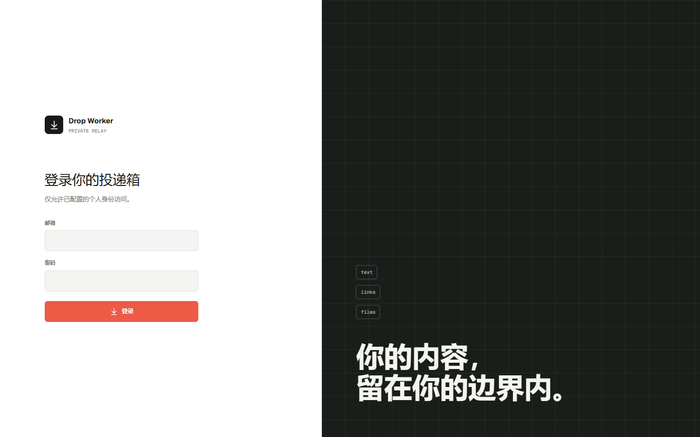
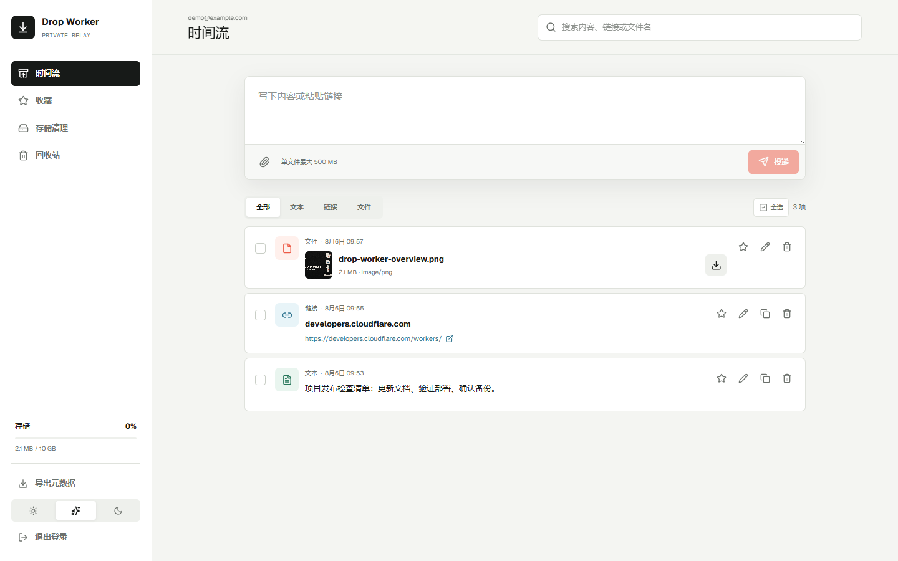
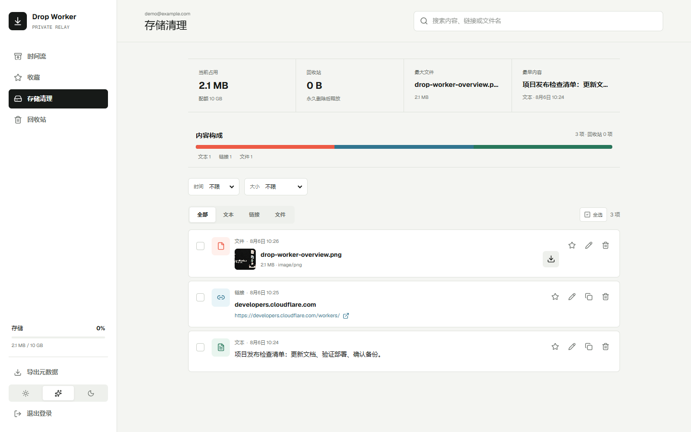

# Drop Worker

Drop Worker 是一个单用户、私有的跨设备投递箱，用于保存文本、链接和文件。它提供最新优先的时间流、搜索和类型筛选、收藏、回收站、存储清理、500 MB 分片上传与断点续传。

产品展示名称为 **Drop Worker**；代码目录、npm 包名、Worker 名称、数据库文件名和 API 协议标识继续使用 `drop-worker`，以保持部署和数据兼容性。

## 界面预览

<p align="center">
  <br />
  <br />
  
</p>

应用支持两种正式部署方式：

- Cloudflare：Workers Static Assets + Worker + D1 + R2，使用 Cloudflare Email Service 邮箱验证码或私有 Sites 身份。
- 本地自托管：单个 Node.js 进程 + SQLite + 本地文件系统，可使用 Docker Compose 或直接命令运行。

## 环境要求

- Node.js 24 或更新版本
- npm 11 或 pnpm 10
- Windows 11、Linux x64 与 arm64 均可运行；Docker 镜像跟随 Node 官方多架构镜像。
- Cloudflare 部署需要 Wrangler 4
- Docker 部署需要 Docker Compose 2.24 或更新版本

## 本地直接运行

安装依赖并创建配置：

```powershell
pnpm install
Copy-Item .env.example .env
```

密码模式先生成密码哈希：

```powershell
pnpm admin -- hash-password "一条至少 12 个字符的强密码"
```

把输出写入 `.env` 的 `ADMIN_PASSWORD_HASH`，同时设置 `ADMIN_EMAIL` 和长度至少 32 个字符的 `SESSION_SECRET`。随后构建并启动：

```powershell
pnpm build
pnpm start
```

默认地址为 `http://localhost:3000`。SQLite、文件对象和未完成上传默认保存在 `./data`。

本地自托管入口是 `server/local.ts`：元数据使用 Node.js 内置 SQLite，文件和上传分片使用 `DATA_DIR` 下的本地文件系统。该模式不读取 `wrangler.jsonc`，不连接 D1 或 R2，也不需要 Cloudflare 账号与 Wrangler。

### 邮件验证码模式

将 `.env` 中的 `AUTH_MODE` 改为 `smtp-otp`，并填写：

- `SMTP_HOST`
- `SMTP_PORT`
- `SMTP_SECURE`
- `SMTP_USER` / `SMTP_PASSWORD`（服务器需要认证时）
- `SMTP_FROM`

验证码 10 分钟有效，登录会话保持 30 天。

### HTTP 与 HTTPS

localhost 可以直接使用 HTTP。局域网中的非 localhost HTTP 地址必须显式设置：

```dotenv
ALLOW_INSECURE_HTTP=true
```

该模式会持续显示安全警告，不能直接暴露到公网。公网或不受信任的局域网应使用 Caddy、Nginx 等反向代理提供 HTTPS，并把 `PUBLIC_URL` 设置为最终 HTTPS 地址。

## Docker Compose

准备 `.env` 后运行：

```powershell
docker compose up -d --build
```

默认映射到主机 `3000` 端口。需要更换主机端口时设置 `HOST_PORT`。应用数据存入命名卷 `drop-worker-data`，容器内进程使用非 root 用户运行。

Docker Compose 与直接命令运行使用相同的 SQLite 和本地文件系统适配器，不会使用 Cloudflare D1/R2。

## Linux systemd

仓库提供 `deploy/drop-worker.service` 示例。将项目安装到 `/opt/drop-worker`，创建专用 `drop-worker` 系统用户，准备 `.env` 并完成生产构建后，再安装和启用该服务。

## 备份与恢复

完整备份和迁移需要一致的只读窗口：先停止应用写入（本地部署建议停止服务或容器），再执行备份；备份结束后才能恢复写入。远程迁移时同样不要在源实例继续投递、编辑或删除内容。

本地完整备份：

```powershell
pnpm admin -- backup ./backups/manual
```

恢复到空数据目录：

```powershell
pnpm admin -- restore ./backups/manual
```

恢复命令默认拒绝覆盖已有数据库。网页中的“导出元数据”会生成 JSON 索引，适合审阅和轻量备份；完整文件备份使用管理命令或 R2 兼容工具。

### Cloudflare 与本地实例迁移

管理 CLI 也可以通过已认证的 HTTP API 创建可移植备份：

```powershell
$env:DROP_WORKER_BASE_URL="https://drop.example.com"
$env:CF_ACCESS_CLIENT_ID="你的 Access 服务令牌 ID"
$env:CF_ACCESS_CLIENT_SECRET="你的 Access 服务令牌 Secret"
pnpm admin -- remote-backup ./backups/cloudflare
```

将 `DROP_WORKER_BASE_URL` 和认证环境变量指向一个空的目标实例后恢复：

```powershell
pnpm admin -- remote-restore ./backups/cloudflare
```

本地密码部署也可以通过 `DROP_WORKER_COOKIE` 提供已登录会话 Cookie。恢复只允许写入空实例，不保留旧条目 ID，也不提供两个运行实例之间的实时同步。

## Cloudflare 直接部署

仓库只提交脱敏的 `wrangler.example.jsonc`。首次部署前先复制一份本地配置：

```powershell
Copy-Item wrangler.example.jsonc wrangler.jsonc
```

模板中的 JSONC 中文注释会逐项说明 Worker 入口、静态资源、D1、R2、邮件、变量、定时任务和可观测性配置。

然后编辑 `wrangler.jsonc` 中的 `<D1_DATABASE_ID>`、R2 桶名、个人邮箱和发件地址。真实的 `wrangler.jsonc` 已被 `.gitignore` 忽略，不要强制提交它；它包含部署资源 ID 和个人邮箱等实例信息。`wrangler.example.jsonc` 只保留可公开的配置结构和占位值。

`wrangler.jsonc` 声明了 D1、R2、静态资源、每小时清理任务和可观测性。首次部署前：

1. 在 Cloudflare Email Service 中启用发信域名，并验证接收验证码的个人邮箱。
2. 配置 `OWNER_EMAIL`、`AUTH_FROM_EMAIL` 和 `AUTH_FROM_NAME`。`AUTH_FROM_EMAIL` 必须属于已在 Email Service 中验证的域名；`send_email` 绑定固定收件人，发件地址可以按配置切换。
3. 使用 `wrangler secret put AUTH_SESSION_SECRET` 设置至少 32 字节的随机会话密钥。
4. 在 Worker 的 Custom Domains 中绑定自己的域名或子域名。
5. 生成类型并应用 D1 迁移。
6. 构建并部署 Worker。

```powershell
npm run cf:types
npx wrangler d1 migrations apply drop-worker --remote --config wrangler.jsonc
npm run cf:deploy
```

验证码 10 分钟有效，连续输入错误 5 次后失效，同一邮箱 60 秒内不能重复发送。登录会话通过 HttpOnly、Secure Cookie 保持 30 天；R2 桶保持私有。

### Cloudflare 自定义 SMTP

如果不使用 Cloudflare Email Service，可以切换为自定义 SMTP。Cloudflare Workers 的 TCP Socket 不允许连接 25 端口，因此 SMTP 必须使用 465（隐式 TLS）或 587（STARTTLS）：

```jsonc
{
  "vars": {
    "AUTH_EMAIL_PROVIDER": "smtp",
    "SMTP_HOST": "smtp.example.com",
    "SMTP_PORT": "587",
    "SMTP_SECURE": "false",
    "SMTP_FROM": "drop-worker@example.com",
    "AUTH_FROM_NAME": "Drop Worker"
  }
}
```

然后把凭据写入 Worker Secret：

```powershell
"你的 SMTP 用户名" | npx wrangler secret put SMTP_USERNAME
"你的 SMTP 密码" | npx wrangler secret put SMTP_PASSWORD
npm run cf:deploy
```

SMTP 用户名和密码不会写入 `wrangler.jsonc` 或日志。Cloudflare 部署使用 SMTP 配置时，`SMTP_FROM` 是实际发件地址；留空时回退到 `AUTH_FROM_EMAIL`。使用自定义 SMTP 时不需要 `send_email` 绑定，GitHub Actions 生成的生产配置会自动省略它。

### 从本机部署 Cloudflare Worker

以下命令虽然从本机执行，但部署目标仍是 Cloudflare Worker，因此生产数据使用配置中的 D1/R2；它们不属于前文的本地自托管。GitHub Actions 自动部署是额外入口，不替代这些 Wrangler 命令。仓库根目录中保留自己的、已被 Git 忽略的 `wrangler.jsonc` 后，可直接运行：

```powershell
npm ci
npm run build
npm run cf:types:check
npm run cf:dry-run
npm run cf:deploy
```

`cf:dry-run` 会构建并检查本机 `wrangler.jsonc`，但不会上传；`cf:deploy` 会使用同一份本机配置完成构建和部署。也可以直接执行 `npx wrangler deploy --config wrangler.jsonc`。`scripts/render-wrangler-config.mjs` 只供 GitHub Actions 生成临时生产配置，不参与本地部署命令。

### GitHub Actions 自动部署

Pull Request 只使用 `wrangler.example.jsonc` 执行验证，不会读取生产配置。代码 push 到 `main` 后会先完成类型检查、Lint、测试和生产构建；全部通过后，部署任务会从 GitHub `production` Environment 读取配置，生成临时 `wrangler.jsonc`，同步 Worker Secret 并自动部署。真实配置不会进入仓库。

在 GitHub 仓库的 `Settings > Environments` 中创建 `production` Environment，并配置以下 Variables：

| Variable | 用途 | 留空时的默认值 |
| --- | --- | --- |
| `WORKER_NAME` | Worker 名称 | `drop-worker` |
| `D1_DATABASE_NAME` | D1 数据库名称 | 与 Worker 名称相同 |
| `R2_BUCKET_NAME` | R2 桶名称 | `<WORKER_NAME>-files` |
| `AUTH_EMAIL_PROVIDER` | `cloudflare` 或 `smtp` | `cloudflare` |
| `MAX_STORAGE_BYTES` | 最大存储字节数 | `10737418240` |
| `AUTH_FROM_NAME` | 邮件显示的发件人名称 | Worker 名称 |
| `SMTP_PORT` | SMTP 端口，只能是 465 或 587 | `587` |
| `SMTP_SECURE` | 是否使用隐式 TLS | `false` |
| `SMTP_TIMEOUT_MS` | SMTP 超时毫秒数 | `15000` |
| `CF_ACCESS_TEAM_DOMAIN` | 可选的 Cloudflare Access 团队域名 | 空 |
| `CF_ACCESS_AUD` | 可选的 Cloudflare Access Audience | 空 |

再配置以下 Secrets。GitHub Variables 不是机密存储，个人邮箱、资源 ID、账号凭据和密码应放在 Secrets：

| Secret | 用途 | 要求 |
| --- | --- | --- |
| `CLOUDFLARE_API_TOKEN` | Wrangler 部署凭据 | 必填 |
| `CLOUDFLARE_ACCOUNT_ID` | Cloudflare Account ID | 必填 |
| `D1_DATABASE_ID` | 生产 D1 数据库 UUID | 必填 |
| `OWNER_EMAIL` | 唯一允许登录并接收验证码的邮箱 | 必填 |
| `AUTH_FROM_EMAIL` | Cloudflare Email Service 发件地址或 SMTP 回退地址 | Cloudflare 发信时必填 |
| `AUTH_SESSION_SECRET` | 30 天会话签名密钥 | 必填，至少 32 字节随机值 |
| `SMTP_HOST` | 自定义 SMTP 服务器 | SMTP 模式必填 |
| `SMTP_FROM` | 自定义 SMTP 实际发件地址 | SMTP 模式可与 `AUTH_FROM_EMAIL` 二选一 |
| `SMTP_USERNAME` | SMTP 用户名 | SMTP 模式必填 |
| `SMTP_PASSWORD` | SMTP 密码 | SMTP 模式必填 |

部署配置由 `scripts/render-wrangler-config.mjs` 校验。缺少必填值、D1 ID 不是 UUID、SMTP 端口错误或 Secret 未配置时，工作流会明确失败，不会拿脱敏模板部署到生产。

生产数据库迁移保持为独立人工步骤，不会在应用启动或每次部署时隐式执行。

## 开发与验证

```powershell
npm run dev
npm run typecheck
npm run lint
npm test
```

开发服务器默认使用本地模拟的 D1/R2，并以固定开发身份进入应用。开发数据不是生产数据。

## 项目结构

- `app/`：React/Vinext 页面、布局和主工作区交互。
- `app/client/`：浏览器 API 客户端、显示格式和断点上传队列持久化。
- `apps/api/`：与部署平台无关的 Hono 路由、HTTP 中间件和运行时接口。
- `apps/api/stores/`：D1/R2 与 SQLite/本地文件系统适配器。
- `packages/contracts/`：前后端共享的 Zod 请求、响应和领域契约。
- `worker/`：Cloudflare Worker、Email Service、自定义 SMTP 和平台身份适配。
- `server/`：本地 Node.js 入口、认证、管理和备份迁移命令。
- `db/` 与 `drizzle/`：共享表结构和正式数据库迁移。

## 数据与安全边界

- 不提供公开分享、多用户空间或匿名文件访问。
- 不抓取链接元数据，不解析或索引文件内部内容。
- 不记录正文、链接、文件名、密码或验证码到日志。
- 不缓存 API 数据用于离线访问；Service Worker 只缓存应用外壳和静态资源。
- 不提供端到端加密。部署者仍需保护主机、Cloudflare 账号、SMTP 凭据和备份文件。
